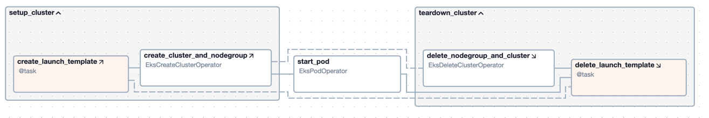

# Airflow Demo DAGs
This repository contains a collection of Apache Airflow Directed Acyclic Graphs (DAGs) designed to run on [Astro](https://www.astronomer.io/), a managed Airflow service. 
These DAGs are intended to serve as examples for various use-cases and to demonstrate best practices for developing Airflow DAGs.

# Project Contents
## DAGs
This repository contains the following DAGs:

### Cluster Setup and Teardown DAG ([setup_teardown_dag](dags/setup_teardown_eks.py))
This DAG demonstrates the creation and deletion of an Amazon EKS cluster using setup and teardown tasks and the EKS Operators from the Airflow AWS provider.
You can use this pattern to automate the creation and deletion of EKS clusters as needed to run compute-intensive workloads on Kubernetes.

Key Features
- Creates an EKS cluster and managed node group via EksCreateClusterOperator with imdsv2 authentication
- Runs a pod on the EKS cluster using the EksPodOperator
- Uses task groups to organize setup and teardown tasks
- Deletes the EKS cluster and node group using EksDeleteClusterOperator at the end of the workflow even if the workflow fails, ensuring resources get cleaned up

Before running the DAG, ensure that you have set up the following:
- An [AWS connection](https://airflow.apache.org/docs/apache-airflow-providers-amazon/stable/connections/aws.html) in Airflow with your AWS credentials
- The CLUSTER_NAME, NODEGROUP_NAME, AWS_CONN_ID, AWS_REGION, CLUSTER_ROLE_ARN, NODEGROUP_ROLE_ARN, and SUBNET_IDS variables in the DAG file

## Project Structure
This Astro project contains the following files and folders:

- dags: This folder contains demo Airflow DAGs
- Dockerfile: This file contains a versioned Astro Runtime Docker image that is used to run the project in development and production.
- packages.txt: File for extra OS-level packages that should be installed 
- requirements.txt: File for extra Python packages that should be installed
- plugins: Add custom or community plugins for your project to this file. It is empty by default.
- airflow_settings.yaml: Local-only file to automatically create Airflow Connections, Variables, and Pools

# Run Project
## Locally
Pre-requisites:
- [Docker](https://docs.docker.com/get-docker/)
- [Astro CLI](https://docs.astronomer.io/astro/cli/install-cli)

1. Clone this repository to your local machine.

2. Start Airflow on your local machine by running 'astro dev start'.

This command will spin up 4 Docker containers on your machine, each for a different Airflow component:

- Postgres: Airflow's Metadata Database
- Webserver: The Airflow component responsible for rendering the Airflow UI
- Scheduler: The Airflow component responsible for monitoring and triggering tasks
- Triggerer: The Airflow component responsible for triggering deferred tasks

3. Verify that all 4 Docker containers were created by running 'docker ps'.

Note: Running 'astro dev start' will start your project with the Airflow Webserver exposed at port 8080 and Postgres exposed at port 5432. If you already have either of those ports allocated, you can either [stop your existing Docker containers or change the port](https://docs.astronomer.io/astro/test-and-troubleshoot-locally#ports-are-not-available).

4. Access the Airflow UI for your local Airflow project. To do so, go to http://localhost:8080/ and log in with 'admin' for both your Username and Password.

You should also be able to access your Postgres Database at 'localhost:5432/postgres'.

## Deploy the Project to Astronomere
If you have an Astronomer account, pushing code to a Deployment on Astronomer is simple. For deploying instructions, refer to Astronomer documentation: https://docs.astronomer.io/cloud/deploy-code/
